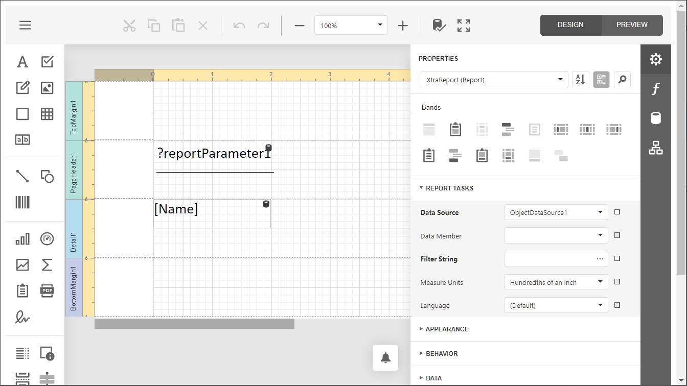
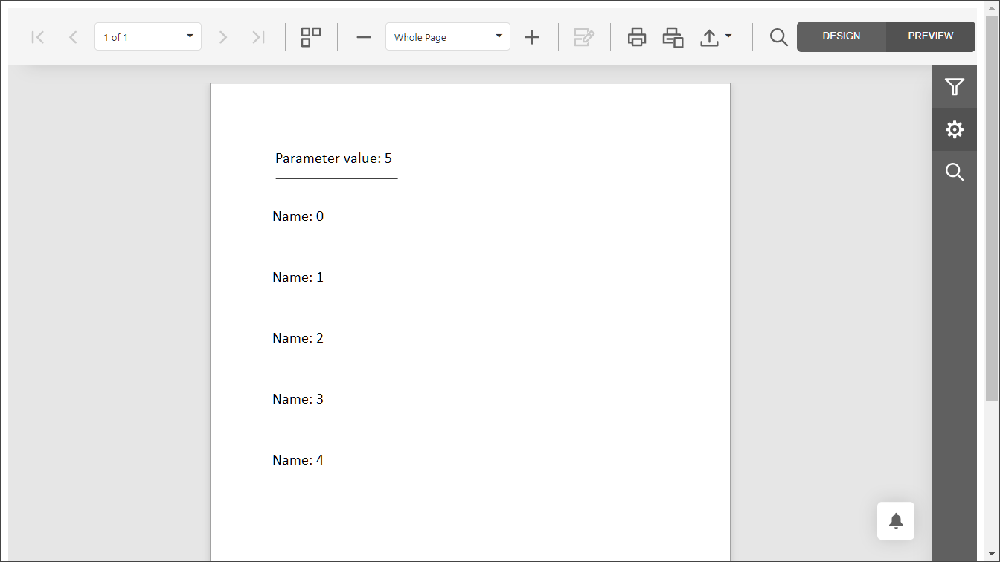

<!-- default badges list -->

<!-- default badges end -->
# How to Create a Report Bound to the ObjectDataSource with Constructor Parameters Linked to Report Parameters

This example creates a report in code, binds it to the object data source with a parameterized [constructor](https://docs.devexpress.com/CoreLibraries/DevExpress.DataAccess.ObjectBinding.ObjectDataSource.Constructor), and maps the [data source parameters](https://docs.devexpress.com/CoreLibraries/DevExpress.DataAccess.ObjectBinding.ObjectDataSource.Parameters) to the [report parameters](https://docs.devexpress.com/XtraReports/4812).

The resulting report is shown below.

- End-User Report Designer for Web:

    

- Report Designer Preview: 

    

## Files to Review

- [Default.aspx](CS/DXWebApplication1/Default.aspx) (VB: [Default.aspx](VB/DXWebApplication1/Default.aspx))
- [Default.aspx.cs](CS/DXWebApplication1/Default.aspx.cs) (VB: [Default.aspx.vb](VB/DXWebApplication1/Default.aspx.vb))

## Documentation

- [Bind a Report to an Object Data Source](https://docs.devexpress.com/XtraReports/17784)
- [Create Object Data Source at Runtime (ASP.NET Web Forms)](https://docs.devexpress.com/XtraReports/401900)
- [Use ObjectDataSource](https://docs.devexpress.com/CoreLibraries/403658) 

## More Examples

- [How to Use the Object Data Source in Web Reporting Applications](https://github.com/DevExpress-Examples/Reporting-Object-Data-Source-Web-Application) 
- [How to bind a report to an object data source](https://github.com/DevExpress-Examples/reporting-winforms-bind-object-data-source-runtime)
- [Reporting for ASP.NET Core - Inject Data from the Entity Framework Core DbContext into a Report Using the Object Data Source](https://github.com/DevExpress-Examples/reporting-asp-net-core-inject-data-from-efcore-dbcontext-into-report-using-object-data-source)

